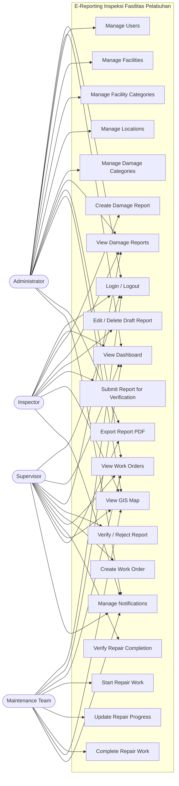
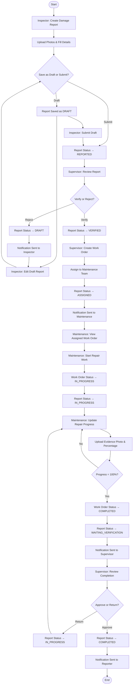
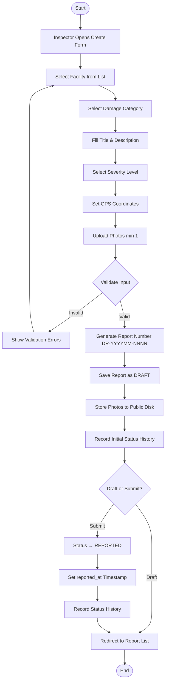
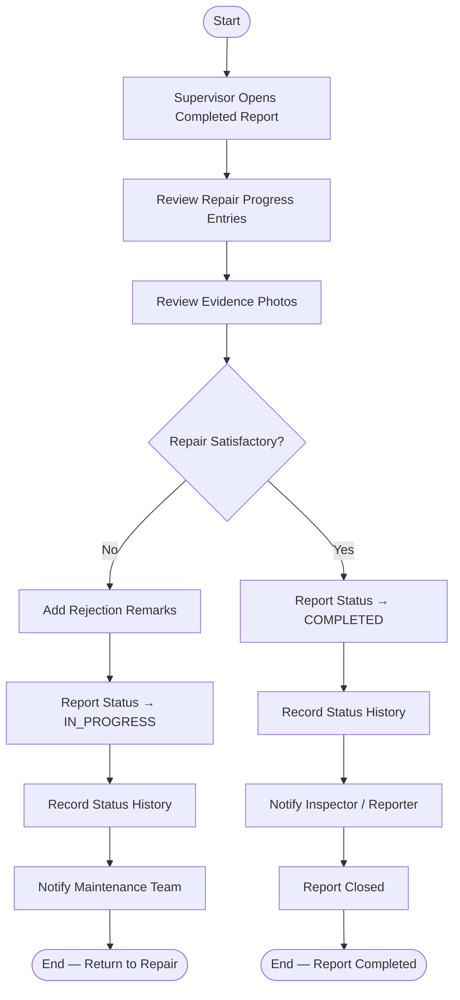
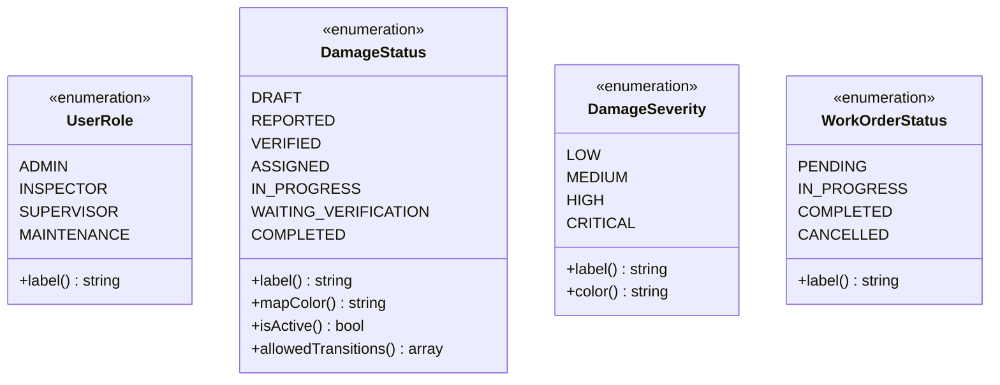
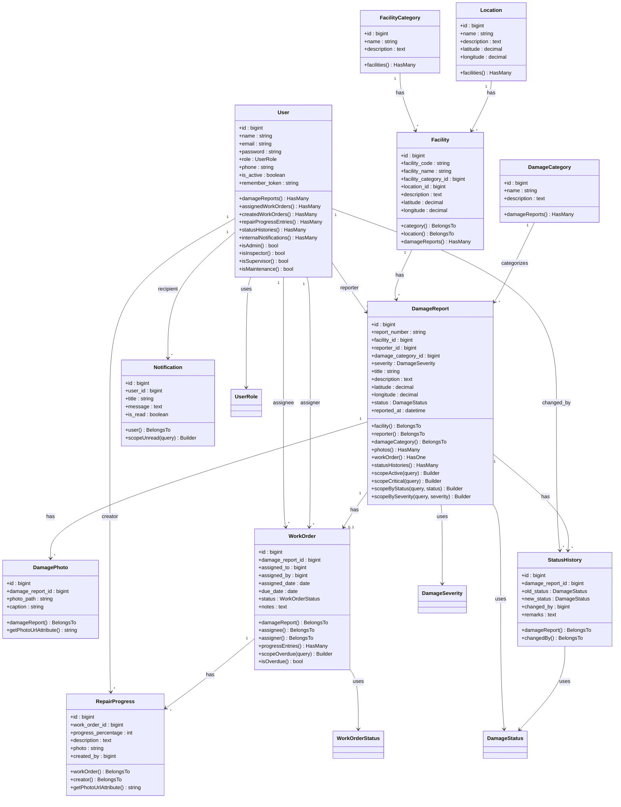
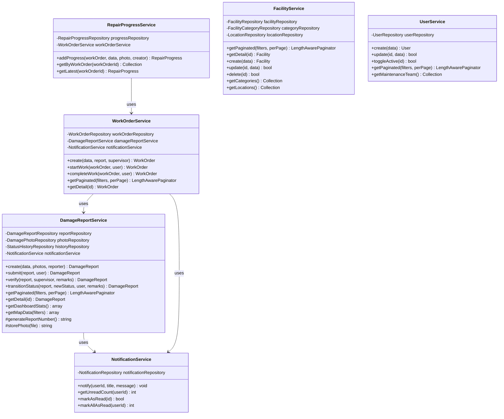

# SYSTEM DIAGRAMS

# E-REPORTING INSPEKSI FASILITAS PELABUHAN

Version: 1.0

---

## 1. USE CASE DIAGRAM



### Use Case Description Table

| ID | Use Case | Actor | Description |
|---|---|---|---|
| UC01 | Login / Logout | All Actors | Authenticate into the system |
| UC02 | View Dashboard | All Actors | View KPI cards, charts, and summary |
| UC03 | Manage Users | Admin | Create, edit, deactivate user accounts |
| UC04 | Manage Facilities | Admin | CRUD facility master data |
| UC05 | Manage Facility Categories | Admin | CRUD facility category master data |
| UC06 | Manage Locations | Admin | CRUD location master data |
| UC07 | Manage Damage Categories | Admin | CRUD damage category master data |
| UC08 | Create Damage Report | Inspector | Input damage report with photos and coordinates |
| UC09 | View Damage Reports | All Actors | Browse and filter damage reports |
| UC10 | Edit / Delete Draft Report | Inspector | Modify or delete own draft reports |
| UC11 | Submit Report for Verification | Inspector | Transition draft → reported status |
| UC12 | Verify / Reject Report | Supervisor | Verify or reject a reported damage |
| UC13 | Create Work Order | Supervisor | Assign maintenance team to verified report |
| UC14 | View Work Orders | Supervisor, Maintenance | Browse work order list |
| UC15 | Start Repair Work | Maintenance | Mark work order as in-progress |
| UC16 | Update Repair Progress | Maintenance | Add progress entries with percentage and photos |
| UC17 | Complete Repair Work | Maintenance | Mark work order as completed (100%) |
| UC18 | Verify Repair Completion | Supervisor | Verify and close completed repair |
| UC19 | View GIS Map | All Actors | View damage locations on interactive map |
| UC20 | Export Report PDF | Admin, Supervisor | Generate and download monitoring reports |
| UC21 | Manage Notifications | All Actors | View and mark notifications as read |

---

## 2. ACTIVITY DIAGRAM

### 2.1 Main Business Process — Damage Report Lifecycle



### 2.2 Create Damage Report — Detailed Activity



### 2.3 Verify Repair Completion — Detailed Activity



---

## 3. ENTITY RELATIONSHIP DIAGRAM (ERD)

```mermaid
erDiagram

    %% ============================================
    %% MASTER DATA ENTITIES
    %% ============================================

    users {
        bigint id PK
        varchar name
        varchar email UK
        varchar password
        varchar role
        varchar phone
        boolean is_active
        timestamp created_at
        timestamp updated_at
    }

    facility_categories {
        bigint id PK
        varchar name UK
        text description
        timestamp created_at
        timestamp updated_at
    }

    locations {
        bigint id PK
        varchar name UK
        text description
        decimal latitude
        decimal longitude
        timestamp created_at
        timestamp updated_at
    }

    damage_categories {
        bigint id PK
        varchar name UK
        text description
        timestamp created_at
        timestamp updated_at
    }

    %% ============================================
    %% CORE ENTITIES
    %% ============================================

    facilities {
        bigint id PK
        varchar facility_code UK
        varchar facility_name
        bigint facility_category_id FK
        bigint location_id FK
        text description
        decimal latitude
        decimal longitude
        timestamp created_at
        timestamp updated_at
    }

    damage_reports {
        bigint id PK
        varchar report_number UK
        bigint facility_id FK
        bigint reporter_id FK
        bigint damage_category_id FK
        varchar severity
        varchar title
        text description
        decimal latitude
        decimal longitude
        varchar status
        timestamp reported_at
        timestamp created_at
        timestamp updated_at
    }

    damage_photos {
        bigint id PK
        bigint damage_report_id FK
        varchar photo_path
        varchar caption
        timestamp created_at
        timestamp updated_at
    }

    work_orders {
        bigint id PK
        bigint damage_report_id FK_UK
        bigint assigned_to FK
        bigint assigned_by FK
        date assigned_date
        date due_date
        varchar status
        text notes
        timestamp created_at
        timestamp updated_at
    }

    repair_progress {
        bigint id PK
        bigint work_order_id FK
        tinyint progress_percentage
        text description
        varchar photo
        bigint created_by FK
        timestamp created_at
        timestamp updated_at
    }

    status_histories {
        bigint id PK
        bigint damage_report_id FK
        varchar old_status
        varchar new_status
        bigint changed_by FK
        text remarks
        timestamp created_at
        timestamp updated_at
    }

    notifications {
        bigint id PK
        bigint user_id FK
        varchar title
        text message
        boolean is_read
        timestamp created_at
        timestamp updated_at
    }

    %% ============================================
    %% RELATIONSHIPS
    %% ============================================

    facility_categories ||--o{ facilities : "has many"
    locations ||--o{ facilities : "has many"
    facilities ||--o{ damage_reports : "has many"
    users ||--o{ damage_reports : "reports as reporter"
    users ||--o{ work_orders : "assigned to"
    users ||--o{ work_orders : "assigned by"
    users ||--o{ repair_progress : "creates"
    users ||--o{ status_histories : "changes"
    users ||--o{ notifications : "receives"
    damage_categories ||--o{ damage_reports : "categorizes"
    damage_reports ||--o{ damage_photos : "has many"
    damage_reports ||--o| work_orders : "has one"
    damage_reports ||--o{ status_histories : "has many"
    work_orders ||--o{ repair_progress : "has many"
```

### Cardinality Summary

| Relationship | Cardinality | FK Column | On Delete |
|---|---|---|---|
| FacilityCategory → Facility | 1 : N | `facility_category_id` | RESTRICT |
| Location → Facility | 1 : N | `location_id` | RESTRICT |
| Facility → DamageReport | 1 : N | `facility_id` | RESTRICT |
| User → DamageReport | 1 : N | `reporter_id` | RESTRICT |
| DamageCategory → DamageReport | 1 : N | `damage_category_id` | RESTRICT |
| DamageReport → DamagePhoto | 1 : N | `damage_report_id` | CASCADE |
| DamageReport → WorkOrder | 1 : 1 | `damage_report_id` (UNIQUE) | CASCADE |
| DamageReport → StatusHistory | 1 : N | `damage_report_id` | CASCADE |
| User → WorkOrder (assigned) | 1 : N | `assigned_to` | RESTRICT |
| User → WorkOrder (assigner) | 1 : N | `assigned_by` | RESTRICT |
| WorkOrder → RepairProgress | 1 : N | `work_order_id` | CASCADE |
| User → RepairProgress | 1 : N | `created_by` | RESTRICT |
| User → StatusHistory | 1 : N | `changed_by` | RESTRICT |
| User → Notification | 1 : N | `user_id` | CASCADE |

---

## 4. CLASS DIAGRAM

### 4.1 Enums



### 4.2 Model Layer (Eloquent Models)



### 4.3 Service Layer



### 4.4 Repository Layer

```mermaid
classDiagram
    class BaseRepository {
        <<abstract>>
        #Model model
        +all(columns) Collection
        +paginate(perPage, columns) LengthAwarePaginator
        +find(id, columns) Model
        +findOrFail(id, columns) Model
        +create(data) Model
        +update(id, data) bool
        +delete(id) bool
        +count() int
        #newQuery() Builder
    }

    class DamageReportRepository {
        +paginateWithRelations(filters, perPage) LengthAwarePaginator
        +findWithFullRelations(id) DamageReport
        +countActive() int
        +countCompleted() int
        +countCritical() int
        +getReportsForMap(filters) Collection
    }

    class WorkOrderRepository {
        +paginateWithRelations(filters, perPage) LengthAwarePaginator
        +findWithRelations(id) WorkOrder
    }

    class RepairProgressRepository {
        +getByWorkOrder(workOrderId) Collection
        +getLatestByWorkOrder(workOrderId) RepairProgress
    }

    class UserRepository {
        +paginateWithFilters(filters, perPage) LengthAwarePaginator
        +getMaintenanceTeam() Collection
    }

    class FacilityRepository {
        +paginateWithRelations(filters, perPage) LengthAwarePaginator
        +findWithRelations(id) Facility
    }

    class FacilityCategoryRepository {
        +getAllWithFacilityCount() Collection
    }

    class LocationRepository {
        +getAllWithFacilityCount() Collection
    }

    class DamagePhotoRepository
    class DamageCategoryRepository
    class StatusHistoryRepository
    class NotificationRepository {
        +countUnreadByUser(userId) int
        +markAsRead(id) bool
        +markAllAsReadForUser(userId) int
    }

    BaseRepository <|-- DamageReportRepository
    BaseRepository <|-- WorkOrderRepository
    BaseRepository <|-- RepairProgressRepository
    BaseRepository <|-- UserRepository
    BaseRepository <|-- FacilityRepository
    BaseRepository <|-- FacilityCategoryRepository
    BaseRepository <|-- LocationRepository
    BaseRepository <|-- DamagePhotoRepository
    BaseRepository <|-- DamageCategoryRepository
    BaseRepository <|-- StatusHistoryRepository
    BaseRepository <|-- NotificationRepository
```



### 4.5 Controller Layer

```mermaid
classDiagram
    class Controller {
        <<abstract>>
    }

    class DamageReportController {
        -DamageReportService reportService
        -DamageReportRepository reportRepo
        -FacilityRepository facilityRepo
        -DamageCategoryRepository categoryRepo
        +index(request) View
        +create() View
        +store(request) RedirectResponse
        +show(id) View
        +edit(id) View
        +update(request, id) RedirectResponse
        +submit(id) RedirectResponse
        +verify(request, id) RedirectResponse
        +destroy(id) RedirectResponse
    }

    class WorkOrderController {
        -WorkOrderService workOrderService
        -UserService userService
        +index(request) View
        +show(id) View
        +create(reportId) View
        +store(request, reportId) RedirectResponse
        +startWork(id) RedirectResponse
        +completeWork(id) RedirectResponse
    }

    class RepairProgressController {
        -RepairProgressService progressService
        +store(request, workOrderId) RedirectResponse
        +show(workOrderId) View
    }

    class DashboardController {
        -DamageReportService reportService
        +index() View
    }

    class FacilityController {
        -FacilityService facilityService
        +index(request) View
        +create() View
        +store(request) RedirectResponse
        +show(id) View
        +edit(id) View
        +update(request, id) RedirectResponse
        +destroy(id) RedirectResponse
    }

    class UserController {
        -UserService userService
        +index(request) View
        +create() View
        +store(request) RedirectResponse
        +edit(id) View
        +update(request, id) RedirectResponse
        +toggleActive(id) RedirectResponse
    }

    class GisController {
        -DamageReportService reportService
        +index() View
        +getData(request) JsonResponse
    }

    class ReportController {
        +index(request) View
        +exportPdf(request) Response
    }

    class NotificationController {
        -NotificationService notificationService
        +index() View
        +markAsRead(id) RedirectResponse
        +markAllAsRead() RedirectResponse
        +unreadCount() JsonResponse
    }

    Controller <|-- DamageReportController
    Controller <|-- WorkOrderController
    Controller <|-- RepairProgressController
    Controller <|-- DashboardController
    Controller <|-- FacilityController
    Controller <|-- UserController
    Controller <|-- GisController
    Controller <|-- ReportController
    Controller <|-- NotificationController

    DamageReportController --> DamageReportService : uses
    WorkOrderController --> WorkOrderService : uses
    RepairProgressController --> RepairProgressService : uses
    DashboardController --> DamageReportService : uses
    FacilityController --> FacilityService : uses
    UserController --> UserService : uses
    GisController --> DamageReportService : uses
    NotificationController --> NotificationService : uses
```



### 4.6 Full Architecture Overview

```mermaid
flowchart TB
    subgraph Presentation["Presentation Layer"]
        BladeViews[Blade Views]
    end

    subgraph Controllers["Controller Layer"]
        DC[DamageReportController]
        WOC[WorkOrderController]
        RPC[RepairProgressController]
        DBC[DashboardController]
        FC[FacilityController]
        UC[UserController]
        GC[GisController]
        RC[ReportController]
        NC[NotificationController]
    end

    subgraph Services["Service Layer"]
        DRS[DamageReportService]
        WOS[WorkOrderService]
        RPS[RepairProgressService]
        FS[FacilityService]
        US[UserService]
        NS[NotificationService]
    end

    subgraph Repositories["Repository Layer"]
        BR[BaseRepository]
        DRR[DamageReportRepository]
        WOR[WorkOrderRepository]
        RPR[RepairProgressRepository]
        FR[FacilityRepository]
        UR[UserRepository]
        NR[NotificationRepository]
    end

    subgraph Models["Model Layer"]
        User
        DamageReport
        WorkOrder
        RepairProgress
        Facility
        FacilityCategory
        Location
        DamageCategory
        DamagePhoto
        StatusHistory
        Notification
    end

    subgraph Enums["Enum Layer"]
        UserRole
        DamageStatus
        DamageSeverity
        WorkOrderStatus
    end

    BladeViews --> Controllers
    Controllers --> Services
    Services --> Repositories
    Repositories --> Models
    Models --> Enums
```



---

END OF DOCUMENT
