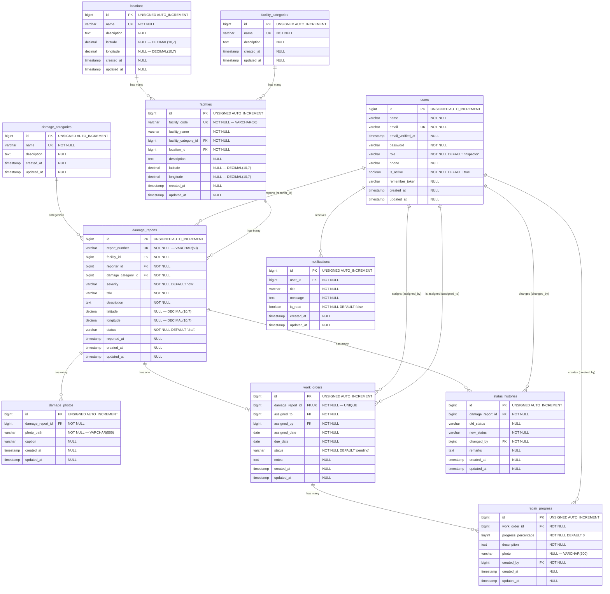

# ENTITY RELATIONSHIP DIAGRAM

# E-REPORTING INSPEKSI FASILITAS PELABUHAN

Version: 1.0

---

---

## RELATIONSHIP REFERENCE TABLE

| Parent | Child | Cardinality | FK Column | On Delete |
|---|---|---|---|---|
| `facility_categories` | `facilities` | One-to-Many | `facility_category_id` | RESTRICT |
| `locations` | `facilities` | One-to-Many | `location_id` | RESTRICT |
| `facilities` | `damage_reports` | One-to-Many | `facility_id` | RESTRICT |
| `users` | `damage_reports` | One-to-Many | `reporter_id` | RESTRICT |
| `damage_categories` | `damage_reports` | One-to-Many | `damage_category_id` | RESTRICT |
| `damage_reports` | `damage_photos` | One-to-Many | `damage_report_id` | CASCADE |
| `damage_reports` | `work_orders` | One-to-One | `damage_report_id` (UNIQUE) | CASCADE |
| `damage_reports` | `status_histories` | One-to-Many | `damage_report_id` | CASCADE |
| `users` | `work_orders` | One-to-Many | `assigned_to` | RESTRICT |
| `users` | `work_orders` | One-to-Many | `assigned_by` | RESTRICT |
| `work_orders` | `repair_progress` | One-to-Many | `work_order_id` | CASCADE |
| `users` | `repair_progress` | One-to-Many | `created_by` | RESTRICT |
| `users` | `status_histories` | One-to-Many | `changed_by` | RESTRICT |
| `users` | `notifications` | One-to-Many | `user_id` | CASCADE |

---

## CARDINALITY NOTATION

| Symbol | Meaning |
|---|---|
| `\|\|` | Exactly one (mandatory) |
| `o\|` | Zero or one (optional) |
| `o{` | Zero or many |
| `\|{` | One or many |

---

END OF DOCUMENT
